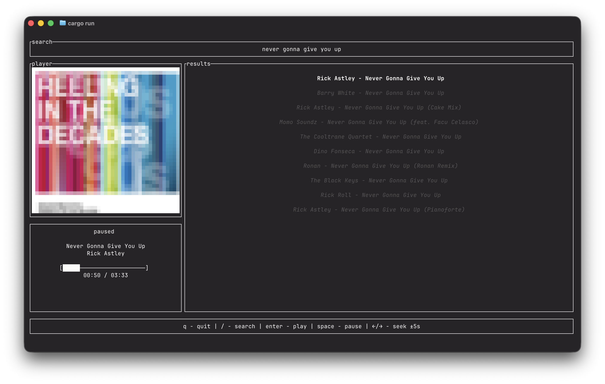

# harp-rs
> a music player which uses deezer and youtube to play your songs in rust!

***released for the kernel sidequest for flavortown***


## installation
**currently, the harp is only compatible with macos and linux!**

make sure you have mpv installed - 

### macos
install mpv using brew
```sh
brew install mpv
```
then, just extract the appropriate release, wether intel or arm, and run - 
```sh
chmod +x hifi-cli
./hifi-cli
```
have fun!

### linux
install mpv using your package manager
```sh
sudo apt install mpv # debian, ubuntu, mint
sudo pacman -S mpv # arch btw
sudo dnf install mpv # fedora
```
then just install the linux release and run - 
```sh
chmod +x hifi-cli
./hifi-cli
```

## roadmap
currently, the project is at a very simple mvp, but there are a few features that i want to add, which would make it more like a music player! 

features to add -
- option to choose metadata provider
- lyrics
- better UI, with colors and different views
- windows binary